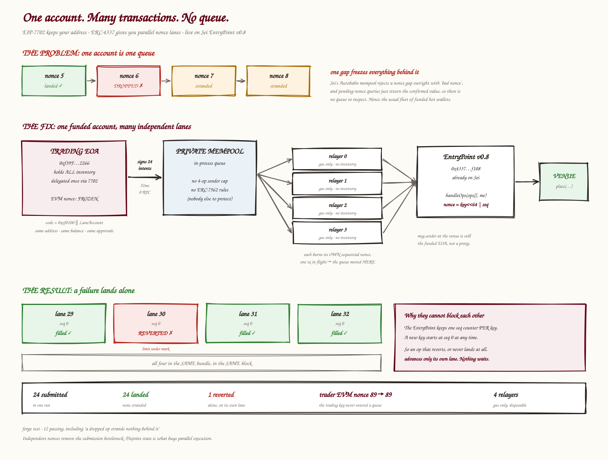

# Nonce lanes: concurrent submission from one Sei account

Submit many independent actions from one funded address without putting that
account behind a single sequential EVM nonce queue.

The mechanism is ERC-4337's two-dimensional nonce, which this repository calls a
**lane**. Operations on different lanes have no ordering relationship, so one
stuck operation strands nothing behind it.

> [!NOTE]
> This is submission concurrency, not parallel execution. Lanes remove *ordering*
> between submissions; they do not make conflicting storage writes run in
> parallel. See [Submission concurrency is not execution parallelism](#submission-concurrency-is-not-execution-parallelism).

This repository combines:

- **EIP-7702** to keep the existing EOA address, balance, and approvals;
- **ERC-4337 v0.8** to give that address independent two-dimensional nonce lanes;
- an in-process bundling queue to avoid public-mempool sender limits;
- gas-only relayers that submit `EntryPoint.handleOps` transactions; and
- a write-ahead journal that recovers evicted or interrupted outer transactions
  at the same relayer nonce.

The expected EntryPoint is the canonical v0.8 singleton at
`0x4337084D9E255Ff0702461CF8895CE9E3b5Ff108`.

> [!IMPORTANT]
> This is a runnable engineering demonstration, not a production trading
> service. It uses a mock venue, plaintext development keys in `.env`, an
> in-process queue, and console output rather than an HSM, strategy engine,
> durable database, observability stack, or audited deployment process.



## Contents

- [The problem](#the-problem)
- [The mechanism](#the-mechanism)
- [Architecture](#architecture)
- [Repository map](#repository-map)
- [Quick verification](#quick-verification)
- [End-to-end local run](#end-to-end-local-run)
- [Run on Atlantic-2](#run-on-atlantic-2)
- [Real SEI/native-USDC load test](#real-seinative-usdc-load-test)
- [Runtime walkthrough](#runtime-walkthrough)
- [Failure and recovery semantics](#failure-and-recovery-semantics)
- [Commands](#commands)
- [Configuration](#configuration)
- [Tuning](#tuning)
- [Security and production limitations](#security-and-production-limitations)
- [Troubleshooting](#troubleshooting)
- [References and versions](#references-and-versions)
- [License](#license)

## The problem

An EVM account's transaction nonces are strictly sequential. If nonce `n` is
missing, nonce `n + 1` cannot execute first.

Two different failures are often grouped together:

| Event | Does it block later EVM nonces? |
| --- | --- |
| A transaction lands and its call reverts | No. The transaction consumed its nonce. |
| A transaction never lands | Yes. Every later nonce waits for the gap to be filled or replaced. |

The second case is the submission bottleneck. It includes transactions that are
dropped, underpriced, rejected at admission, lost before broadcast, or stranded
after a process failure.

Sei does not expose an Ethereum-style pending state, and its documentation says
not to depend on one: a pending nonce that differs from the confirmed nonce is
listed as unreliable, and `txpool_content` drops the geth-style pending/queued
distinction and truncates its result. What `eth_getTransactionCount(address,
"pending")` returns depends on the node and on whether it runs Giga; it may be a
next-pending nonce from the mempool or just the confirmed nonce. Either way it is
not a foundation to rebuild a pending queue on. Strict producer paths also reject
nonce gaps rather than holding them for later; `npm run baseline` probes the
behavior of the configured RPC path instead of assuming every endpoint behaves
identically.

The usual workaround is several funded hot wallets. That raises throughput, but
fragments balances and approvals and expands the set of keys that can move
inventory.

## The mechanism

### ERC-4337 supplies independent nonce lanes

EntryPoint v0.8 stores an account nonce as:

```text
nonce = (uint192 key << 64) | uint64 sequence
```

The EntryPoint maintains one `sequence` counter for each `key`. This repository
calls the key a **lane**.

- Operations on different lanes have no nonce ordering relationship.
- A new lane starts at sequence `0`.
- Operations on the same lane remain sequential.
- An operation that executes and reverts still consumes its lane sequence.
- An operation that never reaches a successful `handleOps` transaction consumes
  nothing.

`LaneAccount` rejects lane `0`. Most SDKs choose key `0` when no key is supplied;
silently putting every operation there would recreate one queue.
`ADMIN_LANE` exposes the maximum `uint192` key for integrations that need an
explicit ordered lane; this demo does not currently submit operations on it.

### EIP-7702 keeps the funded address

An EIP-7702 authorization installs a delegation designator in the EOA's code
slot:

```text
0xef0100 || LaneAccount implementation address
```

The address does not change. Its native balance, token balances, venue state,
and approvals remain attached to the same address. Calls made through
`LaneAccount.execute` therefore reach the venue with the trading EOA as
`msg.sender`.

The trader spends an ordinary EVM nonce when installing or replacing the
delegation. The `submit` trading path then signs UserOperations and does not send
ordinary transactions from the trader. Administrative scripts such as `fund`
still use the trader's sequential EVM nonce.

EIP-7702 alone does not create parallel nonces. It preserves the account;
ERC-4337 supplies the independent nonce model.

### Gas-only relayers move the remaining queue

UserOperations are not transactions. Gas-only relayers wrap them in
`EntryPoint.handleOps` transactions:

```text
trader signs UserOperations
          |
          v
in-process bundling queue
          |
          +--------+--------+--------+
          v        v        v        v
       relayer 0 relayer 1 relayer 2 relayer N
          \        |        |       /
                   v
           EntryPoint.handleOps
                   |
                   v
        LaneAccount.execute -> venue
```

The sequential constraint has not disappeared. Each relayer still has one
sequential EVM nonce stream and submits one outer transaction at a time. The
difference is the custody boundary: relayers hold native tokens for gas, not
trading inventory, and they cannot create a valid UserOperation without the
trader's signature.

## Architecture

The application is a one-shot Node.js CLI, not a daemon. One `npm run submit`
process performs the complete run and exits.

### On-chain components

1. **EntryPoint v0.8** validates signatures, nonce lanes, and prefund, then calls
   the delegated account.
2. **LaneAccount** inherits `Simple7702Account` and adds one policy:
   lane `0` is forbidden.
3. **MockPerpVenue** supplies observable success and slippage-revert behavior.
   It is a test target, not a real exchange integration.

### Off-chain components

1. **Configuration** loads the root `.env`, constructs the trader and relayer
   accounts, validates the selected chain, and creates the viem client.
2. **LanePool** reads every configured lane once at startup, then tracks the
   next sequence locally. One lane can have at most one in-flight operation.
3. **UserOp builder** packs the lane nonce and gas pairs, encodes
   `LaneAccount.execute`, computes the EntryPoint EIP-712 digest, and signs it
   with the trader key.
4. **BundlingQueue** is a FIFO queue of signed operations. It never places two
   operations from the same lane in one bundle.
5. **RelayerPool** runs one asynchronous worker per relayer. Each worker
   simulates, signs, journals, broadcasts, and waits for one `handleOps`
   transaction before advancing.
6. **OperationJournal** stores signed UserOperations and every signed outer
   transaction before broadcast. A lock prevents two `submit` processes from
   assigning the same lanes.

There are no worker threads. Signing is scheduled concurrently in the Node
process, relayer workers overlap network waits, and JavaScript queue mutation
remains single-threaded.

## Repository map

```text
.
├── src/
│   ├── LaneAccount.sol          EIP-7702 implementation and lane-0 guard
│   └── MockPerpVenue.sol        Demo venue with observable slippage failures
├── test/
│   └── ParallelNonce.t.sol      EntryPoint-level isolation and ordering tests
├── script/
│   └── Deploy.s.sol             Deploys LaneAccount and MockPerpVenue
├── app/
│   ├── src/
│   │   ├── abi.ts               Minimal EntryPoint/account/venue ABIs
│   │   ├── baseline.ts          Live sequential-nonce contrast
│   │   ├── bundling-queue.ts    In-process queue and lane-safe bundle packing
│   │   ├── config.ts            Pure environment parsing and validation
│   │   ├── delegate.ts          Installs the EIP-7702 delegation
│   │   ├── delegation-code.ts   Pure EIP-7702 designator parser
│   │   ├── delegation.ts        Reads and validates delegation designators
│   │   ├── dispense.ts          Splits externally supplied gas funds
│   │   ├── env.ts               Runtime config, accounts, chain, and clients
│   │   ├── fund.ts              Funds relayers and the trader's EP deposit
│   │   ├── journal.ts           Signed-operation write-ahead journal
│   │   ├── lanes.ts             Local lane allocation and sequence tracking
│   │   ├── relayers.ts          Bundle simulation, submission, and recovery
│   │   ├── run-lock.ts          Cross-workflow lock for one trading account
│   │   ├── status.ts            Read-only network/account preflight
│   │   ├── submit.ts            End-to-end orchestrator and report
│   │   ├── swap-config.ts       Atlantic-2 DragonSwap and swap settings
│   │   ├── swap-setup.ts        Native-USDC approval and liquidity setup
│   │   ├── swap-submit.ts       Real-swap orchestrator and report
│   │   ├── userop.ts            UserOperation packing, hashing, and signing
│   │   └── *.test.ts            Unit tests, colocated with what they cover
│   ├── scripts/diagram.mjs      Generates the architecture SVG
│   ├── tsconfig.json            Strict TypeScript configuration
│   └── package.json             CLI and verification scripts
├── .github/workflows/ci.yml     Contract, app, and diagram checks
├── assets/how-it-works.svg      Generated visual explainer
├── .env.example                 Documented runtime configuration
├── .nvmrc                       Node version used by CI and `nvm use`
├── foundry.lock                 Pinned submodule revisions
├── foundry.toml                 Solidity build, remappings, and formatting
├── LICENSE                      MIT
├── NOTICE                       Third-party licenses, including one GPL-3.0 dependency
└── SECURITY.md                  How to report a vulnerability
```

Everything under `lib/` is a pinned Git submodule, with revisions recorded in
`foundry.lock`. A source archive from GitHub therefore contains no dependencies;
clone with `--recurse-submodules`, or run `git submodule update --init
--recursive` in an existing clone.

## Quick verification

### Prerequisites

- Git with submodule support
- [Foundry](https://getfoundry.sh/) with `forge`, `anvil`, and `cast`
- Node.js 22 or newer, and npm (`.nvmrc` pins 24, the Active LTS)

Clone dependencies with the repository:

```bash
git clone --recurse-submodules https://github.com/sei-protocol/sei-nonce-lanes.git
cd sei-nonce-lanes
```

For an existing clone:

```bash
git submodule update --init --recursive
```

Install the Node dependencies and run all local checks:

```bash
cd app
npm ci
npm run check
cd ..

forge fmt --check
forge test -vv
```

The Foundry suite runs against the real EntryPoint v0.8 code from the pinned
`account-abstraction` dependency, placed at the canonical address in the local
test VM. It proves:

- different lanes can land in any order;
- an execution revert affects only its own lane;
- an operation that is never submitted does not block other lanes;
- a failed execution advances only its own sequence;
- a gap on one shared lane reproduces sequential blocking;
- one validation failure reverts the whole bundle;
- lane `0` is rejected; and
- a 50-lane bundle uses one outer EVM transaction.

The Node suite covers configuration, lane allocation, bundle lane isolation,
UserOperation packing, delegation parsing, journal replay/locking, and
same-nonce relayer replacement after restart.

## End-to-end local run

This path forks Atlantic-2 but spends only Anvil funds.

### 1. Start a Prague fork

EIP-7702 requires a Prague-capable local node. Keep this terminal running:

```bash
anvil \
  --fork-url https://evm-rpc-testnet.sei-apis.com \
  --chain-id 1328 \
  --hardfork prague
```

The fork carries the deployed EntryPoint bytecode. The repository compiles its
contracts for Cancun because they do not use Prague-only opcodes; the local node
must still run Prague to accept the type-4 delegation transaction.

### 2. Create local-only configuration

```bash
cp .env.example .env
```

Set these local values in `.env`:

```dotenv
SEI_CHAIN_ID=1328
SEI_RPC_URL=http://127.0.0.1:8545

RELAYER_COUNT=4
RELAYER_START_INDEX=1
```

Set `TRADER_PRIVATE_KEY` to account `0`'s private key from the Anvil startup
output, and set `RELAYER_MNEMONIC` to the mnemonic printed by that same local
Anvil process. Never use either value on a public network.

Starting relayers at index `1` keeps the trader and relayer identities distinct.
The application rejects overlapping identities.

### 3. Deploy the demo contracts

From the repository root:

```bash
forge script script/Deploy.s.sol:Deploy \
  --rpc-url http://127.0.0.1:8545 \
  --broadcast \
  --unlocked \
  --sender 0xf39Fd6e51aad88F6F4ce6aB8827279cffFb92266
```

Copy the printed values into `.env`:

```dotenv
LANE_ACCOUNT_IMPL=0x...
VENUE=0x...
```

### 4. Install, delegate, fund, and submit

```bash
cd app
npm ci

npm run status
npm run delegate
npm run fund
npm run status
npm run submit
```

`status` is read-only. `delegate` spends the trader's EVM nonce once. `fund`
uses ordinary trader transactions to top up relayers and pre-deposit gas in the
EntryPoint. `submit` then verifies that the trader's EVM nonce does not move.

By default, one order receives an unfillable limit price. Its UserOperation
reverts during execution while the neighboring lanes continue.

## Run on Atlantic-2

Atlantic-2 uses chain ID `1328` and the public RPC
`https://evm-rpc-testnet.sei-apis.com`.

1. Copy `.env.example` to `.env`.
2. Create a new throwaway trader key and a separate, fresh relayer mnemonic.
3. Fund the trader from the [Sei faucet](https://docs.sei.io/learn/faucet).
4. Set `SEI_CHAIN_ID=1328`, the Atlantic-2 RPC, and the fresh credentials.
5. Deploy with a funded key, not Anvil's unlocked account:

```bash
export DEPLOYER_PRIVATE_KEY=0x...

forge script script/Deploy.s.sol:Deploy \
  --rpc-url https://evm-rpc-testnet.sei-apis.com \
  --broadcast \
  --private-key "$DEPLOYER_PRIVATE_KEY"

unset DEPLOYER_PRIVATE_KEY
```

The deployer may be the throwaway trader, but it does not have to be. Copy the
printed contract addresses into `.env`, then run:

```bash
cd app
npm ci
npm run status
npm run delegate
npm run fund
npm run submit
```

> [!CAUTION]
> Never use Anvil, Hardhat, tutorial, or shared test mnemonics on Atlantic-2 or
> Pacific-1. Their addresses and keys are public. Some are already delegated to
> sweeper code, so a successful funding transaction can still leave a zero
> balance.

The app's mutating commands block remote Pacific-1 writes unless
`ALLOW_MAINNET=1` is explicitly set. That opt-in prevents an accidental
`SEI_CHAIN_ID=1329` run; it does not guard the separate Forge deployment command
or make this demo production-ready.

## Real SEI/native-USDC load test

The optional real-swap path uses the documented DragonSwap V1 deployment and
Circle-issued native USDC on Atlantic-2. It is hard-blocked on every other
chain. Obtain testnet USDC from the [Circle Faucet](https://faucet.circle.com/)
for the configured trader, then run:

```bash
cd app
npm run swap:setup
npm run swap:submit
```

`swap:setup` uses ordinary trader transactions to approve a limited amount of
USDC and create/seed the WSEI/USDC pair if the factory has no live pair. The
approval covers the larger of the configured run requirement and
`SWAP_RETAINED_USDC_ALLOWANCE`. The defaults seed 100 SEI and 100 USDC. This is
public testnet liquidity, not a private fixture.

`swap:submit` alternates tiny native SEI -> native USDC and native USDC -> native
SEI swaps through independent ERC-4337 lanes. It reports execution outcomes
from EntryPoint events instead of issuing one RPC read per swap. `ORDERS`,
`LANE_POOL_SIZE`, `MAX_OPS_PER_BUNDLE`, and `REVERT_ORDER_INDEX` control the run:

```bash
ORDERS=3000 \
LANE_POOL_SIZE=3000 \
MAX_OPS_PER_BUNDLE=4 \
REVERT_ORDER_INDEX=2 \
npm run swap:submit
```

The configured trader must hold enough of both assets for every input-side swap
to execute regardless of landing order. One deliberately impossible minimum
output demonstrates that a slippage revert does not strand neighboring lanes.
Set `REVERT_ORDER_INDEX=-1` when measuring maximum throughput.

## Runtime walkthrough

`app/src/submit.ts` is the orchestrator.

### 1. Preflight

The process:

- confirms the configured RPC's chain ID;
- confirms code exists at the expected EntryPoint address;
- requires `LANE_ACCOUNT_IMPL` and `VENUE`;
- verifies that the trader delegates to the configured implementation;
- reads the venue mark, trader balance, EntryPoint deposit, and trader EVM nonce;
- opens and exclusively locks the operation journal; and
- reads each relayer's confirmed nonce and gas balance.

The EntryPoint check confirms code presence, not a byte-for-byte deployment
identity. Verify canonical addresses independently before a real deployment.

### 2. Gas and lane initialization

The process estimates:

- current network fees, with headroom in the signed UserOperations;
- the delegated account's complete venue call; and
- each outer `handleOps` transaction before signing it.

`CALL_GAS_LIMIT` is a floor. If the live delegated-call estimate plus headroom is
higher, the application raises the per-operation call gas limit.

`LanePool.create` reads `EntryPoint.getNonce(trader, lane)` for lanes
`1..LANE_POOL_SIZE`, with bounded RPC concurrency. Those values become local
`nextSeq` counters. The hot signing path performs no nonce reads.

Lane acquisition is last-in, first-out, so the default 32-lane pool begins with
lanes `32`, `31`, `30`, and so on. Lane number has no priority or execution-order
meaning.

### 3. Restart reconciliation

Before creating new work, the process compares every incomplete journal entry
with the EntryPoint:

- chain sequence greater than journal sequence: the operation was consumed;
- equal sequences: reserve the lane and recover or requeue the operation;
- chain sequence lower than journal sequence: stop because the state is
  inconsistent.

Interrupted outer transactions are recovered before any new UserOperation is
signed. If their outcome remains ambiguous, the process exits and keeps the
journal intact.

### 4. UserOperation construction

For each available lane, the app encodes:

```text
EntryPoint.handleOps(
  LaneAccount.execute(
    MockPerpVenue.place(orderId, quantity, limitPrice)
  )
)
```

More precisely, `buildOp` creates a packed v0.8 UserOperation:

- `sender`: the trading EOA;
- `nonce`: `(lane << 64) | sequence`;
- `initCode`: empty because the EOA is already delegated;
- `callData`: `LaneAccount.execute(venue, 0, venueCall)`;
- packed verification/call gas limits;
- packed priority/max fees;
- no paymaster; and
- an EIP-712 signature from the trader.

The digest is computed locally, then the first digest is compared with
`EntryPoint.getUserOpHash` as a runtime compatibility check.

### 5. Bundling

Signed operations enter an in-process FIFO. `takeBundle` selects up to
`MAX_OPS_PER_BUNDLE` operations and refuses to include two operations from the
same lane.

Because the queue never leaves the process, it is not subject to the ERC-7562
default `SAME_SENDER_MEMPOOL_COUNT = 4` limit for an unstaked sender. It does not
bypass EntryPoint signature, nonce, execution-gas, or prefund validation.

### 6. Relayer submission

Each relayer worker:

1. takes one bundle;
2. simulates `handleOps` with `eth_estimateGas`;
3. signs an EIP-1559 outer transaction at its current confirmed nonce;
4. writes the signed raw transaction to the journal;
5. broadcasts it;
6. waits for a receipt; and
7. only then moves to its next nonce.

The relayer is also the `handleOps` beneficiary, so the EntryPoint's gas
reimbursement returns to that gas-paying address.

### 7. Reporting and cleanup

The receipt's `UserOperationEvent` records whether each operation executed
successfully. The demo also reads `isFilled` and `landingSeq` from the mock
venue, prints a per-order report, and compares the trader's EVM nonce before and
after the run.

When every bundle is resolved, completed journal entries are cleared. Otherwise
the command exits non-zero and leaves enough information for the next `submit`
invocation to recover.

## Failure and recovery semantics

| Situation | Lane sequence | Other lanes in the bundle | Recovery |
| --- | --- | --- | --- |
| UserOperation executes successfully | Consumed | Continue | None |
| UserOperation execution reverts | Consumed | Continue | Retry the intent on the lane's next sequence if desired |
| UserOperation validation fails | Not consumed | Entire `handleOps` transaction reverts | Fix the cause and resubmit |
| Signed UserOperation was never put in a mined bundle | Not consumed | Independent lanes remain valid | Journal requeues it |
| Outer transaction times out or is evicted | Unknown until reconciled | Bundle remains intact | Rebroadcast and fee-bump at the same relayer nonce |
| Outer transaction mines and reverts | Not consumed | No operation in that bundle executes | Relayer nonce is consumed; UserOperations can be requeued |
| Process exits after journaling | Determined at restart | No new work starts first | Reconcile receipts, lane nonces, and relayer nonce |

### Why execution reverts are isolated

EntryPoint handles an account call failure as a per-operation result. It emits a
failed `UserOperationEvent`, charges gas, advances that operation's lane, and
continues with the next operation.

### Why validation failures affect the bundle

A bad signature, stale nonce, or insufficient prefund fails during
`handleOps` validation and reverts the outer transaction. No operation in that
transaction is consumed. Every bundle is simulated before broadcast, but
simulation is not a substitute for keeping bundles narrow when isolation
matters.

### Same-nonce outer replacement

If no receipt arrives within `BUNDLE_RECEIPT_TIMEOUT_MS`, the relayer:

1. checks every previously signed attempt for a receipt;
2. signs a fee-bumped replacement with the same EVM nonce;
3. journals it before broadcast; and
4. repeats up to `BUNDLE_MAX_ATTEMPTS` for that process invocation.

On restart, the last exact raw transaction is rebroadcast first. A fresh
same-nonce replacement budget is then available. The worker never sends nonce
`n + 1` while a transaction at `n` might still land.

The journal uses restricted file permissions and temp-file replacement to
survive normal process crashes. It is not a replicated database and does not
claim durability through disk, kernel, or host failure. Journal version 2 stores
each signed outer transaction once per bundle rather than duplicating it in
every operation record; version 1 files migrate automatically.

## Commands

Run npm commands from `app/`.

| Command | Mutates chain? | Purpose |
| --- | --- | --- |
| `npm run status` | No | Print chain, delegation, balances, deposits, relayer nonces, lane sequences, and venue state |
| `npm run delegate` | Yes | Install or replace the trader's EIP-7702 delegation |
| `npm run fund` | Yes | Use trader transactions to top up relayers and `EntryPoint.depositTo(trader)` |
| `npm run dispense` | Yes | Wait for relayer 0 to receive SEI, then split it across relayers |
| `npm run submit` | Yes | Build, journal, bundle, submit, recover, and report UserOperations |
| `npm run swap:setup` | Yes | Approve native USDC and seed the Atlantic-2 DragonSwap V1 pair |
| `npm run swap:submit` | Yes | Submit alternating real SEI/native-USDC swaps through nonce lanes |
| `npm run baseline` | Yes | Probe sequential EVM nonce-gap behavior with a gas-only relayer |
| `npm run diagram` | No chain write | Regenerate `assets/how-it-works.svg` |
| `npm test` | No | Run Node unit tests |
| `npm run typecheck` | No | Run strict TypeScript checks |
| `npm run check` | No | Run the TypeScript checker and Node tests |

`submit` and `swap:submit` were previously called `spray` and `swap:spray`. Both
old script names still work as aliases, and `SABOTAGE_INDEX` is still accepted
in place of `REVERT_ORDER_INDEX` with a deprecation warning.

`dispense` polls until relayer `0` has a non-zero balance. Use `Ctrl-C` to stop
waiting. `fund` and `dispense` solve different bootstrapping cases; do not run
both unless that is intentional.

Foundry commands run from the repository root:

| Command | Purpose |
| --- | --- |
| `forge test -vv` | Run the Solidity/EntryPoint property suite |
| `forge fmt --check` | Check Solidity formatting |
| `forge script script/Deploy.s.sol:Deploy ...` | Deploy the account implementation and mock venue |

## Configuration

The app always loads `.env` from the repository root.

### Network and safety

| Variable | Default | Meaning |
| --- | --- | --- |
| `SEI_CHAIN_ID` | `1328` | Supported values are `1328` (Atlantic-2) and `1329` (Pacific-1) |
| `SEI_RPC_URL` | viem chain RPC | HTTP endpoint; its reported chain ID must match `SEI_CHAIN_ID` before writes |
| `ALLOW_MAINNET` | `0` | Must be `1` for writes to a remote Pacific-1 RPC |

Credential-bearing RPC paths and query strings are redacted in status output.

### Accounts and deployments

| Variable | Default | Meaning |
| --- | --- | --- |
| `TRADER_PRIVATE_KEY` | required | Non-zero 32-byte key for the account that signs every UserOperation |
| `RELAYER_MNEMONIC` | required | Fresh English BIP-39 mnemonic used only for gas-paying relayers |
| `RELAYER_COUNT` | `4` | Number of relayer workers; `1..256` |
| `RELAYER_START_INDEX` | `0` | First non-negative mnemonic address index |
| `RELAYER_FUNDING` | `0.5` | Non-negative target SEI balance per relayer for `fund` |
| `ENTRYPOINT_DEPOSIT` | `1` | Non-negative target trader deposit in EntryPoint for `fund` |
| `LANE_ACCOUNT_IMPL` | unset | Deployed `LaneAccount`; required by `delegate` and `submit` |
| `VENUE` | unset | Deployed venue target; required by `submit` |

The trader and every relayer must be distinct, and relayer derivations must not
produce duplicate addresses. Before a relayer funding or submission command,
the app also requires every relayer address to be a plain EOA with no existing
contract code or EIP-7702 delegation.

### Run shape

| Variable | Default | Meaning |
| --- | --- | --- |
| `ORDERS` | `24` | Positive number of demo orders in one durable run |
| `LANE_POOL_SIZE` | `32` | `1..4096` lanes and maximum in-flight UserOperations |
| `MAX_OPS_PER_BUNDLE` | `4` | `1..LANE_POOL_SIZE` operations sharing one validation domain |
| `REVERT_ORDER_INDEX` | `2` | `-1` to disable, otherwise `0..ORDERS-1` |
| `VERIFICATION_GAS_LIMIT` | `150000` | Positive per-operation verification gas |
| `CALL_GAS_LIMIT` | `500000` | Positive execution-gas floor; live estimate may raise it |
| `PRE_VERIFICATION_GAS` | `60000` | Positive per-operation pre-verification gas |

`ORDERS` must not exceed `LANE_POOL_SIZE`; the application rejects that
configuration instead of silently submitting fewer orders than requested.

### Outer transaction recovery

| Variable | Default | Meaning |
| --- | --- | --- |
| `BUNDLE_RECEIPT_TIMEOUT_MS` | `12000` | Positive receipt wait before replacement handling |
| `BUNDLE_MAX_ATTEMPTS` | `3` | Positive same-nonce attempt count per process invocation |
| `REPLACEMENT_FEE_BUMP_PERCENT` | `25` | Fee increase per replacement; accepted range `10..1000` |
| `OPERATION_JOURNAL_PATH` | `app/.state/pending-ops.json` | Durable signed-operation journal |
| `SENDER_RUN_LOCK_PATH` | account-specific file in `app/.state` | Shared lock across every lane workflow for one trader |

### Real-swap path

| Variable | Default | Meaning |
| --- | --- | --- |
| `SWAP_SEI_AMOUNT` | `0.0001` | Native SEI input for each SEI -> USDC swap |
| `SWAP_USDC_AMOUNT` | `0.0001` | Native USDC input for each USDC -> SEI swap |
| `SWAP_LIQUIDITY_SEI` | `100` | Native SEI supplied by `swap:setup` for a new pair |
| `SWAP_LIQUIDITY_USDC` | `100` | Native USDC supplied by `swap:setup` for a new pair |
| `SWAP_RETAINED_USDC_ALLOWANCE` | `10` | Minimum router allowance left after initial liquidity |
| `SWAP_SLIPPAGE_BPS` | `500` | Minimum-output tolerance, in basis points |
| `SWAP_DEADLINE_SECONDS` | `7200` | Signed swap deadline from build time |
| `SWAP_OPERATION_JOURNAL_PATH` | `app/.state/pending-swaps.json` | Separate durable real-swap journal |

## Tuning

### Lane pool size

One lane may hold only one in-flight operation. `LANE_POOL_SIZE` is therefore
the hard ceiling on unresolved UserOperations in this process.

Larger pools:

- permit more concurrently unresolved intents;
- add startup `getNonce` reads; and
- increase recovery state that must be understood after a failure.

### Bundle width

`MAX_OPS_PER_BUNDLE` trades gas efficiency for isolation.

- `1`: maximum validation isolation, highest outer-transaction overhead.
- Larger values: lower amortized overhead, larger shared validation failure
  domain.

Execution reverts remain per-operation even when several operations share a
bundle.

The relayer caps signed transaction gas below the live block gas limit and
rejects a bundle when its estimate cannot fit. On Atlantic-2 on September 3,
2026, the real-swap path sustained 77 operations per bundle; 78 reached the
12,500,000 block-gas ceiling and failed safely during simulation. Width 76
produced the best observed submission rate, 47.7 landed swaps/second. These are
measurements for this call shape and network state, not stable protocol limits.

### Relayer count

Each relayer has one sequential outer transaction stream. Under favorable
admission and inclusion conditions, the immediate submission width is roughly:

```text
RELAYER_COUNT * MAX_OPS_PER_BUNDLE
```

That is a planning heuristic, not a throughput guarantee. RPC latency, block
limits, state contention, gas, and producer policy still apply.

### Submission concurrency is not execution parallelism

Independent nonce lanes remove ordering between submissions. They do not make
conflicting storage writes execute in parallel.

The mock venue stores orders by `orderId`, but also updates a global landing
counter for test observability. It is deliberately not a parallel-execution
benchmark. A real venue integration must analyze its own storage contention.

## Security and production limitations

### Protect local material

Never commit, paste, zip, or hand off:

- `.env`;
- `.env.*` overrides;
- `app/.state/`;
- signed raw transactions;
- wallet files; or
- RPC URLs containing credentials.

The journal does not contain plaintext private keys, but it contains signed
UserOperations and replayable raw transactions. Treat it as sensitive until the
corresponding nonces are consumed.

Clone the repository for a teammate and create fresh keys. Do not copy a dirty
working directory.

### Delegation is powerful

EIP-7702 changes the code executed at the trader's address. Before delegation:

- verify the implementation source and deployed address;
- verify the target chain;
- inspect any existing delegation; and
- use a throwaway account for this demo.

`submit` refuses to run if the current designator does not exactly match
`LANE_ACCOUNT_IMPL`.

### Relayer compromise

A relayer key can lose the native gas balance it controls and can broadcast
already-signed UserOperations. It does not hold venue inventory and cannot sign
new UserOperations for the trader. Keep relayer balances limited to operational
gas needs.

### Venue compatibility

At the venue:

- `msg.sender` is the trading EOA;
- `tx.origin` is the gas-paying relayer.

Contracts that require `tx.origin == msg.sender` are incompatible. Audit each
router, approval path, callback, reentrancy assumption, and authorization rule.

### Missing production systems

Before adapting this design to real trading, add at least:

- audited account and integration contracts;
- hardware-backed or remote signing;
- a real strategy/risk engine and idempotent intent model;
- durable, replicated queue and reconciliation storage;
- metrics, tracing, alerting, and structured logs;
- controlled deployment and delegation procedures;
- RPC redundancy and chain-specific fee policy;
- graceful shutdown and operator runbooks; and
- load, fault-injection, and live-chain recovery testing.

## Troubleshooting

### `Missing ...` or an invalid configuration value

Copy `.env.example` to the repository root and fill every required credential
and deployment address. Numeric values must be finite integers in their
documented ranges.

### RPC chain ID does not match

Check both:

```dotenv
SEI_CHAIN_ID=1328
SEI_RPC_URL=https://evm-rpc-testnet.sei-apis.com
```

For a local fork, pass `--chain-id 1328` to Anvil. The configured chain ID is
part of the EIP-712 signature domain and cannot be guessed safely.

### `EntryPoint v0.8 ... MISSING`

The RPC does not have code at the expected singleton address. Confirm the chain
and fork source before deploying anything.

### Delegation mismatch

Run `npm run status` and compare `delegated to` with `LANE_ACCOUNT_IMPL`. Do not
blindly replace an unexpected designator. Confirm the account, chain, and
implementation first, then run `npm run delegate` deliberately.

### Relayer has no gas

Run `npm run fund`, or send SEI to relayer `0` and run `npm run dispense`.

### `simulation failed: AA...`

Common validation causes are:

- `AA24`: invalid trader signature or wrong EIP-712 chain/domain;
- `AA25`: stale or incorrect lane sequence;
- insufficient EntryPoint prefund; or
- delegation to the wrong account implementation.

Run `npm run status` and resolve the cause before widening bundles or retrying.

### Journal lock is owned by another process

Only one lane-based process may use a trader at a time, even when `submit` and
`swap:submit` use different journals. Stop the other process. A lock whose
recorded PID is no longer alive is removed automatically on the next run.

### `AA95 out of gas` while widening bundles

The bundle no longer fits the current block gas limit. No operation in a bundle
that fails simulation is broadcast or consumed. Rerun with a smaller
`MAX_OPS_PER_BUNDLE`; the durable queue will be repacked at the smaller width.

### A bundle remains in pending recovery

Do not delete the journal and do not send the relayer's next nonce manually.
Run `npm run submit` again after the RPC can answer receipt and nonce queries. The
process will rebroadcast or replace at the same nonce before creating new work.

If the app reports partial lane consumption or another state it cannot reconcile,
stop and inspect the EntryPoint events, every attempted transaction hash, the
relayer confirmed nonce, and each lane sequence.

## References and versions

Specifications and chain behavior:

- [EIP-7702: Set EOA account code](https://eips.ethereum.org/EIPS/eip-7702)
- [ERC-4337: Account abstraction using alt mempool](https://eips.ethereum.org/EIPS/eip-4337)
- [ERC-7562 validation and mempool rules](https://eips.ethereum.org/EIPS/eip-7562)
- [Sei EVM compatibility](https://docs.sei.io/evm/evm-parity/evm-compatibility)
- [Sei pending state and finality](https://docs.sei.io/evm/evm-parity/finality)
- [Sei transaction types](https://docs.sei.io/evm/evm-parity/transaction-types)

Tested toolchain:

- Foundry 1.8.1
- Solidity 0.8.28
- `account-abstraction` v0.8.0
- OpenZeppelin Contracts v5.1.0
- viem 2.56
- forge-std 1.16.2
- Node.js 22 and 24 (both exercised in CI)

Dependencies are pinned by Git submodule commit and `package-lock.json`. Chain
deployments and RPC behavior can change; rerun the preflight and tests rather
than treating this document as a live network registry.

## License

MIT. See [LICENSE](LICENSE).

The dependencies under `lib/` carry their own terms, including one GPL-3.0
dependency that this project uses only in tests. [NOTICE](NOTICE) explains which
files come from where and why the deployment path stays MIT.

To report a vulnerability, follow [SECURITY.md](SECURITY.md) rather than opening
a public issue.
